# 第九章 動詞時態

英文動詞的時態，可以分成現在、過去、未來等三種**時間（times）**，簡單式、完成式、進行式、完成進行式等四種**狀態（aspects）**。如果再加上主動、被動兩種**語態（voices）**，那麼動詞時態變化多達24種。扣掉一、兩種很少使用的，實際上經常用到的時態也有22至23種之多。

時態的變化很多、很複雜。但是每一個英文句子都有動詞、都會牽涉到時態的判斷。如果時態的觀念不清楚，英文寫作一定會碰到層出不窮的問題。要想駕簡馭繁、輕鬆建立起時態的觀念、打好英文寫作的基礎，有一個變通的辦法可以讓時態問題變得很簡單。做法是在句型詮釋上轉變一下：視 be 為動詞、後面的分​​詞片語視為形容詞補語。從這個角度來看句型，時態問題就很簡單了，只剩下「簡單式」與「完成式」兩種變化。能夠區分簡單式與完成式，就能夠輕鬆掌握動詞時態。

英文動詞的時態，如果認定 be 為動詞，那麼就只剩下**簡單式（simple aspect）**與**完成式（perfect aspect）**這兩種狀態。只要能夠區分清楚這兩種狀態，英文動詞時態就沒問題了。

## 靜態動詞

要想把傳統文法中列出的 24 種時態簡約到只需要瞭解「簡單式」與「完成式」這兩種變化，那麼除了上述「視 be 為動詞、視其後的分詞為形容詞補語」這種變通的詮釋方法之外，還需要了解靜態動詞（static verbs）這個觀念。

英文動詞當中有一批相當「名不符實」，雖然叫做動詞卻並沒有「動作」在裡頭。真正名符其實的動詞如 hit, kill, eat, run, talk, jump, swim 等等，代表的都是某種「動作」。以傳統文法的分類來說，這種「動態」的動詞才能夠有所謂的「進行式」，也就是說只有動態動詞才適合加上 -ing 字尾變成現在分詞、用來表示「正在做」或「一直在做」某個動作。例如：

He <u>is</u> <u>eating breakfast</u> now.
（他現在正在吃早餐。）

The dog <u>was</u> <u>swimming</u> toward the shore then.
（狗當時正在朝岸邊遊。）

如果依照傳統文法的詮釋，第 1 句的動詞是 is eating、「現在進行式」；第2句的動詞是 was swimming、「過去進行式」。關鍵在於 eat 和 swim 都是屬於「動態動詞」、代表的是「動作」，所以才可以有進行式，表示「正在做」或「一直做」這個動作。

簡單化的看法是：第 1 句的動詞是 is、現在簡單式，後面的 eating breakfast 是現在分詞片語，當形容詞補語使用，表達出進行狀態、解釋為「正在吃早飯」，修飾主詞 he。第 2 句的動詞是 was、過去簡單式，它後面 swimming toward the shore 這個現在分詞片語當形容詞補語看待，表達出進行狀態，意思是「正在朝岸邊遊」，修飾主詞 the dog。關鑑在於：表示「動作」的動態動詞如 eat 與 swim 等等才可以有現在分詞的形容詞 eating 與 swimming、表示這個動作「正在進行中」。

反之，如果動詞是「靜態動詞」、並不代表「動作」，自然也就沒有所謂的「正在做」或「一直做」的進行狀態可言。因此，以傳統文法的角度來說：靜態動詞不能用於進行式。換言之，靜態動詞不適合加上-ing字尾成為現在分詞的形容詞。

## 幾個常見的靜態動詞

以下舉一些常見的靜態動詞為例，請讀者一句句思考一下：句中畫底線的部分都是動詞，但沒有一個真正代表「動作」（像 kill, eat 那種動作），所以都不能採用表示「正在做、一直做」的 -ing 字尾（也就是不能採用進行式）。

I <u>am</u> busy; I <u>have</u> a lot of work to do.
（我很忙；我有一堆工作要做。）

This camera <u>belongs</u> to me.
（這架相機屬於我。）

George <u>resembles</u> his father a lot.
（喬治很像他爸爸。）

I <u>believe</u> his story.
（我相信他的故事。）

I <u>like</u> milkshakes.
（我喜歡奶昔。）

I <u>consider</u> him a true friend.
（我認為他是真正的朋友。）

以上這些句子中的動詞如 have, belong, resemble, believe, like, consider，思考一下就會發現都不是真正的「動作」，所以都不適合說「正在做」或「一直做」，因此也都不適合採用現在分詞的進行狀態。不過，同樣的靜態動詞如果改變用法、拿來表示「動作」時，就可以加 -ing 字尾、可以有所謂的進行式了。例如，「是」（be）、「有」（have）和「認為」（consider）都不是真正的動作、屬於靜態動詞。但是，如果 be 解釋為「表現」、have 解釋為「吃」、consider 解釋為「研究」，那就變成了動作，可以用 -ing 來表示「正在表現」、「正在吃」或「正在研究」 ：

When I said she looked 25, I was <u>being</u> nice.
（我說她看起來像25歲，那是在表現禮貌。）

He was <u>having</u> lunch when I called.
（我打電話去的時候他正在吃午餐。）

The committee is <u>considering</u> your proposal.
（委員會正在研究你的提案。）

## 簡單式

簡單式狀態，主要用於交代動作發生在什麼時間內。所以，除非上下文已經有暗示、對方已經知道是什麼時間，否則必須要明確說出動作發生的時間。舉一個例子：

I <u>saw</u> the movie <u>last week</u>.
（那部電影我是上禮拜看的。）

當然，所謂 last week 嚴格講起來有七天之久，而「看電影」的動作可能花不到兩個小時。不過，簡單式的情況通常就是這樣：說出一段時間（如 last week），動作只要落在這段時間之內就行。

### 一．過去時間

簡單式狀態可以用圖像的方式來理解：它標示出來的時間呈括弧形狀，動作就落在括弧裡面。如果這個括弧是在過去，就應採用過去簡單式。例如：

The U.S. <u>declared</u> independence <u>in 1776</u>.
（美國在1776年宣告獨立。）

圖示：

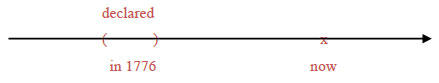

這個句子的時間副詞是 in 1776 這個介係詞片語，標示出一個過去時間的括弧，動作落在這個括弧內，所以動詞應採過去簡單式 declared。

The dynamite <u>was</u> invented by the Chinese.
（火藥是中國人發明的。）

圖示：

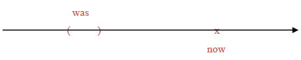

這個句子裡面找不到時間副詞，但是從句意來看，它描述的事情發生在久遠以前，所以它的時間是個過去的括弧，動詞應該是過去簡單式。複雜的動詞時態一定會有 be 動詞在內。認定 be 為動詞，它的過去簡單式就是 was。後面的過去分詞 invented 視為形容詞，表達出「被動」語態，解釋為「被髮明」，作主詞補語使用、修飾主詞 dynamite。這就是一般文法書所謂的過去簡單被動態。

I <u>was</u> playing a video game when the power suddenly <u>went out</u>.
（我正在打電動，忽然停電了。）

圖示：

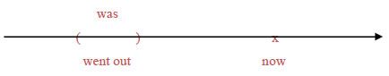

這個句子的時間副詞是 when 引導的那個副詞子句。從副詞子句裡面的過去簡單式動詞 went out 來看，它的時間是一個過去的括弧——而且是個極小的括弧：從「有電」變成「沒電」的那一剎那。以這個時間副詞子句修飾主要子句的動詞（我們一律認定 be 為動詞），那麼主要子句也應該是過去簡單式，所以動詞是 was。後面的現在分詞片語 playing a video game 是動詞play加受詞 a video game 的構造，加上 -ing 字尾變成現在分詞片語之後就是一個形容詞片語，當作主詞補語使用、修飾主詞 I 。現在分詞的 -ing 字尾表達進行狀態，相當於中文的「正在」（短時間）或「一直」（長時間）。就上面這個例子而言，playing a video game 應解釋為「正在打電動」。這就是一般文法書所謂的過去進行式。

I <u>was</u> working on my paper <u>throughout last week</u>
. （上週一整個禮拜我都在寫論文。）

圖示：

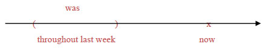

這個句子的時間副詞 throughout last week 是個介係詞片語，表現出一個過去時間的括弧。動詞因而要採過去簡單式 was。後面的現在分詞片語 working on my report 視為形容詞片語，-ing 字尾表達進行狀態，因為是長時間所以就解釋為「一直」在寫論文，當作主語補語使用、修飾主詞 I。

The house <u>was</u> being renovated when it <u>collapsed</u> on the workers
. （這棟房子正在翻修，突然塌下來壓到工人。）

圖示：

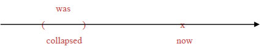

這個句子的時間副詞是 when 引導的那個副詞子句，子句中過去簡單式的動詞 collapsed 顯示它的時間是個過去的括弧。所以，主要子句的動詞也應該是過去簡單式，因此就是was。後面的分詞片語 being renovated 含有現在分詞 being 與過去分詞 renovated，整個分詞片語當形容詞補語使用、修飾主詞the house。現在分詞 being 裡面的 be 無意義、不須解釋，字尾的 -ing 表達進行狀態，因為是短時間所以解釋為「正在」。過去分詞 renovated 表達被動語態、解釋為「被翻修」。整個片語 being renovated 仍視為現在分詞片語，意思是「正在被翻修」。這就是一般文法書所謂的過去進行被動態。

### 二．現在時間

現在簡單式，它的時間就是以 now 為中心​​的一個括弧。所有的簡單式都是括弧形狀的時間，但是過去簡單式的括弧在 now 之前、未來簡單式的括弧在 now 之後，所以括弧的大小都受到限制。只有現在簡單式的括弧是以 now 為中心​​，它的大小不受限制，可以大到無限大、包含過去未來的一切時間。傳統文法列出規則說「真理、事實等要用現在簡單式」，原因就在此。看看幾個例子：

I <u>have</u> a headache.
（我頭痛。）

圖示：

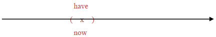

這個句子雖然沒有時間副詞，但是現在簡單式的動詞 have 清楚表示時間就是 now。

Wang Chien-Ming <u>pitches</u> for the Yankees.
（王建民為洋基隊投球。）

圖示：

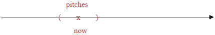

這一句並沒有時間副詞，不過暗示是「現在」。王建民幾年前不是洋基隊的投手、幾年後他也可能不再是。這個句子的時間是一個以 now 為中心​​的比較大的括弧，仍然該用現在簡單式。

Our summer house <u>is</u> located on the lake.
（我們的避暑別墅座落在湖邊。）

圖示：

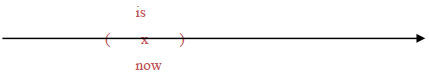

這個句子同樣也沒有時間副詞，但是現在簡單式的動詞 is 表示它的時間是一個以 now 為核心的括弧。後面的過去分詞片語 located on the lake 是形容詞補語，表達出被動語態：字面上是「被擺在湖邊」，也就是「座落在湖邊」。這就是一般文法書所謂的現在簡單被動態。

Please be quiet, because everybody <u>is</u> sleeping <u>now</u>.
（請安靜，因為大家都在睡覺。）

圖示：

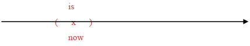

Because 引導的這個表示原因的副詞子句，時間是 now，動詞用的是現在簡單式 is。後面的現在分詞 sleeping 視為形容詞補語，表達出「進行」狀態，解釋為「正在」睡覺。這就是一般文法書所謂的現在進行式。

This store <u>is</u> selling everything at a 30% discount <u>this week</u>, to celebrate its 20th anniversary.
（這家店本週全面打七折、慶祝20週年。）

圖示：

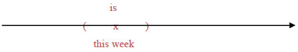

這個句子的時間副詞是 this week，這是一個包含 now 在內的括弧，所以動詞用的是現在簡單式的 is。後面的 selling everything at a 30% discount 這個現在分詞片語視為形容詞補語，現在分詞 selling 表現出進行狀態。因為時間長（有一週），所以 selling 應解釋為「一直賣」。這就是一般文法書所謂的現在進行式。

This road <u>is</u> closed to traffic <u>now</u> because it <u>is</u> being widened.
（這條路目前封閉，因為正在拓寬。）

圖示：

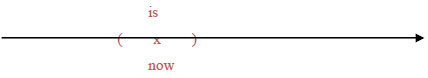

主要子句的時間副詞 now 是標準的現在時間括弧，所以動詞用的是現在簡單式 is。後面的過去分詞片語 closed to traffic 當形容詞補語看待，過去分詞 closed 表達出被動語態，解釋為「被封閉」。另外在 because 引導的副詞子句中，因為是同樣的時間，所以動詞也同樣採取現在簡單式 is。後面的 being widened 這個現在分詞片語視為形容詞補語。其中的現在分詞 being 表達出進行狀態、解釋為「正在」（be 動詞無意義、不須解釋），過去分詞 widened 表達出被動語態、解釋為「被拓寬」。這就是一般文法書所謂的現在進行被動態。

### 三．未來時間

簡單式的時間都是括弧形狀。如果括弧在未來，就應該採取未來簡單式。未來的事情由於尚未發生，牽涉到比較多的不確定因素，所以它的表達方式也比較多樣。未來時間的簡單式動詞，整理一下有6種方式可以表達：

John <u>will leave</u> tomorrow.
John <u>is going to leave</u> tomorrow.
John <u>is to leave</u> tomorrow.
John <u>is leaving</u> tomorrow.
John <u>will be leaving</u> tomorrow.
John <u>leaves</u> tomorrow.

時間副詞 tomorrow 是一個放在未來的括弧，應採未來簡單式。一般文法書所謂的未來簡單式是指上述的第 1 種：will leave。這種使用到助動詞 will 的講法，具有最濃厚的「不確定」語氣，表示「到時候將會、可能會」，語氣的重點放在未來。

第 2 種講法 is going to leave 和第 1 種 will leave 相當接近，不過它比較口語化、比較不正式。而且 is going to leave 這種說法的語氣比較偏重在「現在」的意圖、打算、徵兆等等。例如：

Because the weatherman says it <u>will rain</u> this afternoon, I’<u>m going to bring</u> an umbrella.
(因為氣象報告說下午會下雨，我打算帶把雨傘出門。)

句中的 it will rain this afternoon 講的是「未來時間將會如何」，採用第 1 種講法 will rain 來表示；至於 I'm going to bring an umbrella 講的則是「現在打算到時候將如何」 ，採用第 2 種講法 am going to bring 來表示。

第 3 種講法 is to leave 和第 4 種講法 is leaving 都可以視為第 2 種 is going to leave 的變化。

如果把動詞改一下，從 leave 換成 go，可以看得更清楚：

John <u>is going to go</u> tomorrow.（第2種）

像 is going to go 這種講法，裡面的 going 和 to go 產生重複，是比較拙劣的說法。為了避免重複，可以省掉 going 只留下 to go，就會成為：

John <u>is to go</u> tomorrow.（第3種）

反之，如果省掉的是 to go、只留下 going，就會成為：

John <u>is going</u> tomorrow.（第4種）

這兩種省略的說法分別相當於前述 6 種說法中的第 3 種和第 4 種。所以：第 3 種未來式 John is to leave tomorrow 和第 4 種未來式 John is leaving tomorrow 都可以視為第 2 種未來式 John is going to leave tomorrow 的省略。第 5 種變化則是在第 4 種前面再加一個 will，成為 John will be leaving tomorrow，意思還是差不多。

而且，最適合採用第 3、第 4、第 5 種講法來表達的未來式動詞，大都是一些和 go 有點關連的字，像是 go, come, leave, arrive, begin, end 等等。這些表示「來、去、離開、到達、開始、結束」的字眼，往往代表一種「目前的規畫或打算」，這和第 2 種 be going to V 代表「目前的規畫或打算」的講法是同樣的性質。為了避免重複，所以經常省略成為 be to V（第3種）、be Ving（第4種），或 will be Ving（第5種）。例如：

The weatherman says a Typhoon <u>is coming</u> this way.
(氣象報造說颱風要來了。)

The train <u>is leaving</u> in 10 minutes.
(火車再過十分鐘要開。)

We <u>will be arriving</u> in Shanghai soon.
(我們快要抵達上海了。)

The final game <u>is to start</u> in five minutes.
(決賽再過五分鐘即將開始。)

至於第 6 種講法 John leaves tomorrow，完全是把未來才要發生的事情當做「事實」、採用現在簡單式來敘述。這是語氣最肯定的一種講法。例如：

The train <u>leaves at 2:30</u>.
(火車兩點半開。)

World Cup finals <u>begin tomorrow night</u>.
(世界盃決賽明晚開打。)

這些句子講的都是「早已排定」的事情。雖然尚未發生，但是已經非常確定，可以排除掉帶有不確定意味的助動詞will、直接用現在簡單式把它當做事實來敘述。

再看一個未來式的例子：

I <u>will discuss</u> the plan with my boss <u>next week</u>.
(下星期我會和老闆談一下這個計畫。)

圖示：

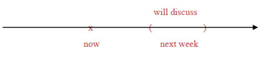

時間副詞 next week 是一個未來時間的括弧。只要可以括出時間來就是簡單式。未來的事情還沒發生、尚未確定，所以要加一個助動詞 will 在前面，意思是「到時候會」。

##### 過去時間的未來

如果以某個過去時間為出發點，它的未來式通常要用到過去拼法的 would。例如：

It was mid-1945; Japan <u>would soon raid</u> Pearl Harbor.
(時間是1945年中；日本即將偷襲珍珠港。)

圖示：

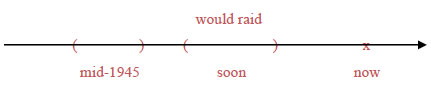

日本偷襲珍珠港，這件事情發生在 1945 年底。相對於1945年中，偷襲珍珠港事件還在不久後的未來。但是這整個都是過去的事件，所以應該用過去拼法的 would soon raid 來表示未來式。

The weatherman <u>said</u> it <u>would rain</u>, but it didn’t.
(氣象報告說會下雨，結果沒下。)

圖示：

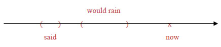

氣象報告員在「說」的時候，「會下雨」還在未來。但是從過去式的 said 來看，這整件事情也是發生在過去，所以要採過去拼法的 would rain 來表現未來式。

#### 一條文法規則

傳統文法中列出一條規則：「表示時間或條件的副詞子句，用現在式代替未來式」。這個變化在英文寫作時確實要能夠掌握，否則很容易出現錯誤。這個問題基本上屬於語氣（moods）的問題，本書在後面的章節會有更完整的處理，屆時我們充分理解之後就不必理會這條規則了。目前我們先初步設法理解這條規則是什麼意思。規則中說到「副詞子句」，所以首先來看一下名詞子句與副詞子句的差別，以免套錯了規則。

##### 副詞子句與名詞子句

規則中所謂「表示時間或條件的副詞子句」，我們先把範圍縮小到兩個連接詞：when和if。請比較下面這兩句：

<u>I</u> <u>know</u> <u>when he left the room</u>.
S V O(名詞子句)
(我知道他何時離開房間的。)

<u>He</u> <u>forgot</u> <u>his briefcase</u> <u>when he left the room</u>.
S V O (副詞子句)
(當他離開房間的時候，他忘了公事包。)

句 1 中的 when he left the room 是名詞子句，當做動詞 know 的受詞。連接詞 when 來自疑問詞、解釋為「何時」。原本是這麼一個疑問句：When did he leave the room?，把問號拿掉、疑問詞 when 轉為連接詞使用，就會變成 when he left the room 這個名詞子句。句 2 中的 when he left the room 看起來完全一樣，卻是個副詞子句，用來修飾動詞 forgot 的時間，屬於時間副詞子句，when 是外加的從屬連接詞，解釋為「當……時候」 。

在此作一個小歸納：若連接詞 when 是外加的、解釋為「當……時候」，它引導的子句就是時間副詞子句。若連接詞 when 來自疑問詞、解釋為「何時」，它引導的子句則是由疑問句轉變過來的名詞子句。

接著再比較下面這兩句：

<u>I</u> <u>don't know</u> <u>if he will get the money</u>.
S V O(名詞子句)
(我不知道他是否會拿到錢。)

<u>If he gets the money</u>, <u>he</u> <u>can help</u> <u>us</u>.
(副詞子句) S V O
(如果他拿到錢,就能幫我們的忙。)

句 1 中的 if he will get the money 是名詞子句，當做動詞 don’t know 的受詞。連接詞 if 相當於 whether、解釋為「是否」。原本是 Will he get the money? 這個疑問句，拿掉問號之後改為 whether/if he will get the money 這個名詞子句。句 2 中的 if he gets the moeny 則是副詞子句，用來修飾動詞 can help 的條件，屬於條件副詞子句，連接詞 if 是外加的、解釋為「如果」。

作一個小歸納：若連接詞 if 是外加的、解釋為「如果」，它引導的子句就是條件副詞子句。若連接詞 if 相當於 whether、解釋為「是否」，它引導的子句就是由疑問句轉變過來的名詞子句。

##### 瞭解文法規則

有了上面那兩項歸納，我們就可以把前面那條文法規則範圍縮小、改寫如下：「When 解釋為『當……時候』、if 解釋為『如果』，這兩種連接詞引導的副詞子句要用現在式代替未來式」。接下來我們要問：為什麼？

When he <u>gets</u> here, the police <u>will be</u> waiting.
（當他來到這裡時，警察將在等候。）

圖示：

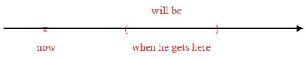

主要子句 the police will be waiting 中的動詞 will be 採用的是未來式，表示這是將來的事情。至於 when he gets here 這個子句，外加的連接詞 when 解釋為「當……時候」，所以它引導的是個時間副詞子句。為什麼這種子句要用現在式動詞gets代替未來式 will get？這是因為：「當……時候」這種子句，語氣就是「當做」已經到了「那個時候」。換句話說：這種子句裡面要把未來「當做」已經到了、就是「現在」，所以動詞要採用現在式。

接下來再看看if這個連接詞：

If he <u>gets to</u> the hospital in time, he’<u>ll be able to see</u> his father for the last time.
（如果他及時趕到醫院，就能見到他父親最後一面。）

圖示：

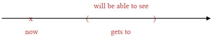

主要子句的動詞 will be able to see 可以看出來是未來式，表示是未來時間。從屬子句 if he gets to the hospital in time，它外加的連接詞if解釋為「如果」，所以這是一個條件副詞子句，裡面的動詞要用現在式 gets 而不用未來式 will get。為什麼？

因為，所謂的「如果」，語氣是把原本還不確定的假設情況當做是事實來敘述，也就是「假如果真」，所以應該採用表達「事實」的現在簡單式。我們不知道例句中的「他」到時候能不能夠趕得及。但是，所謂「『如果』趕到」，意思就是「當做是『真的』趕到」，裡面就該採用事實語氣來敘述，把這件事情當做是真的，所以要用現在式而不是未來式。

## 完成式

簡單式的時間是個「括弧」形狀，動作落在這個括弧裡面。完成式的時間則是個「箭頭」形狀，指出「截止時間」，動作在這個截止時間之前就已經完成。因此，簡單式是比較明確地說明動作發生在什麼時間，完成式則沒有說得那麼清楚，只交代動作在什麼時間之前「已經完成」、並沒有詳細說明到底是在什麼時候發生。以下同樣分成現在、過去、未來這三種時間來說明完成式。

### 一．過去時間

完成式的時間是個指出截止時間的箭頭，如果指出來的截止時間在過去，就該採用過去完成式，例如：

Everybody <u>had left</u> <u>before she got to the station</u>.
(在她趕到車站之前，大家都已經先走了。)

圖示：

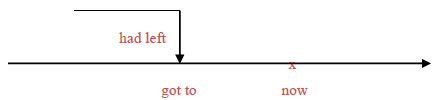

這個句子的時間由 before 引導的時間副詞子句來表示。從副詞子句的過去式動詞 got to 可以看出時間是在過去，再從連接詞 before 可以看出，這個時間副詞子句表達的時間可以畫成一個以過去動作 got to 為截止點的箭頭。換句話說，這個時間副詞子句並沒有清楚交代 leave 這個動作發生在什麼時候（沒有一個明確的括弧如last week之類來表示），只知道這個動作在 got to 這個過去動作之前已經完成。因此主要子句的動詞應該採用過去完成式 had left。再看一個例子：

More than 60,000 soldiers <u>had been</u> killed <u>when the President finally decided to pull out of the war</u>.
(當總統終於決定撤出戰爭時，已經有六萬多名士兵陣亡。)

圖示：

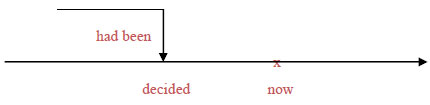

When 引導的時間副詞子句中，過去式動詞 decided 表示時間是在過去。從句意來揣摩，這六萬多名士兵陣亡的時間應該不是「在總統下決定的那一瞬間」、而是在那之前「已經」陣亡。所以這個時間副詞子句表達的時間仍然是個箭頭形狀、指向的截止時間是過去，所以該採用過去完成式 had been。視 had been 為動詞，後面的過去分詞 illed 視為形容詞補語、帶有被動語態，用來形容主詞 more than 60,000 soldiers「被殺死」。這就是一般文法書所謂的過去完成被動態。

所有複雜的動詞時態，一定牽涉到 be 動詞。如果採用本書的方式，認定 be 就是動詞，那麼複雜的動詞時態就只剩下兩種：簡單式（be）與完成式（have been）。再看一個例子：

The students had been preparing for the college entrance exam for three years when the Education Ministry suddenly announced a change of regulations.
(學生一直在準備大學入學考試已經準備了三年，教育部才突然宣佈改變規定。)

圖示：

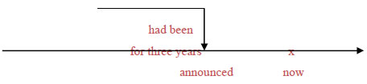

這個句子的時間副詞有 for three years 這個介係詞片語和 when 引導的時間副詞子句。從 when 子句的過去式動詞 announced 來看，時間是在過去。再從介係詞片語 for three years 來看，它的時間應該是個截止箭頭，表示「算到 decided 為止已經有三年」，所以動詞應採過去完成式 had been。後面的現在分詞 preparing 視為形容詞補語，具有「進行」狀態，表示這三年的時間學生「一直」都在準備。這就是一般文法書所謂的過去完成進行式。

像 for three years 或 since three years ago 之類的介係詞片語，分別表示「為期有多久了」或「自從多久之前算起」，代表相同的意義：同樣都用來表示「已經」有多久時間，所以通常都要採用完成式的動詞。

### 二．現在時間

如果上下文都沒有交代或暗示截止時間為何、只說「已經完成」，那麼通常都要採用現在完成式來表示。例如你告訴朋友說「那部電影我已經看過了」，話中雖然沒有說明「在什麼時候之前」已經看過，但是言下之意自然就是「現在以前」，所以該採用現在完成式，如下：

I <u>have seen</u> that movie.

換句話說：除非上下文有明言或者暗示其他的截止時間，否則完成式都應該採用現在完成式。請看幾個例子：

You can’t enter <u>now</u> because the concert <u>has already begun</u>.
(你現在不能進場，因為音樂會已經開始了。)

圖示：

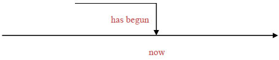

這個句子並沒有明確交代音樂會是什麼時候開始的，只說「已經」開始。再從主要子句的時間副詞 now 來看，截止時間就是現在。換句話說，音樂會是在「現在」之前已經開始，所以該採用現在完成式。再看一個例子：

Everything that can be done <u>has been</u> done; <u>now</u> we can only wait and see.
(可以做的一切都已經做了，現在我們只能等著瞧。)

圖示：

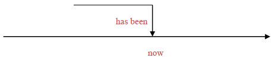

主要子句的動詞采用的是be動詞的現在完成式 has been，表示「到現在為止已經」（be 動詞本身無意義、不須翻譯），後面的過去分詞 done 當形容詞補語看待、表示「被做完」，形容主詞 everything。這就是一般文法書所謂的現在完成被動態。

Those marathon runners <u>have been</u> running <u>for two whole hours</u> without stop <u>now</u>.
(那些馬拉松選手目前為止已經整整跑了兩個小時沒有休息。)

圖示：

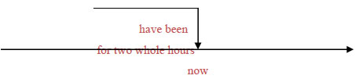

這個句子的時間副詞有 now 以及介係詞片語 for two whole hours，意思是「算到現在為止整整有兩個小時」，很明顯是一個以 now 為截止時間的箭頭、應該採用現在完成式，所以動詞是 have been。後面的現在分詞 running 當形容詞補語看待，形容主詞 runners。字尾的 -ing 表示進行狀態，所以 running 要解釋為「一直在跑」。這就是一般文法書所謂的現在完成進行式。

完成式動詞後面有沒有現在分詞的補語，有時候並無差別、有時候則會造成不一樣的意思。請比較一下這兩個句子：

I <u>have lived</u> here <u>for 20 years</u>.
I <u>have been living</u> here <u>for 20 years</u>.
(我在這（一直）住了20年了。)

圖示：

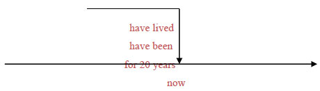

這兩種講法的意思差不多：後者用現在分詞 living 當主詞補語、強調「一直住」，前者沒有強調，但基本上意思相同。再請比較一下這兩個句子：

I <u>have read</u> your book.
(您的大作我拜讀過了。)

I <u>have been</u> reading your book.
(您的大作我最近一直在看。)

圖示：

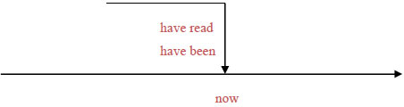

前者表示「已經看完了」，後者則強烈暗示「還在看、尚未看完」。這兩種講法就有很大的差別了。

### 三．未來時間

未來完成式的時間也是一個箭頭形狀，唯一的差別在於它的截止時間在未來。例如：

<u>By August</u> I <u>will have worked</u> at the company <u>for 30 years</u>.
<u>By August</u> I <u>will have been</u> working at the company <u>for 30 years</u>.
(到八月為止我將在這家公司（一直）工作滿30年。)

圖示：

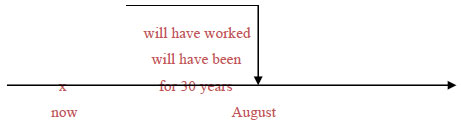

上面這兩個句子相同，時間副詞都是介係詞片語 by August 與 for 30 years。表達的時間是「到八月為止有30年」，顯然是個箭頭形狀、截止時間在八月（未來時間），所以該採用未來完成式。動詞 will have worked 表示「將已經做滿」30年。如果動詞改為 will have been，意思是「將已經」有30年，後面的現在分詞 working 視為形容詞、當主詞補語使用。字尾的 -ing 表達出進行狀態、表示這30年來「一直」在此工作。後者這種說法就是一般文法書所謂的未來完成進行式。

Experts estimate that the last of our oil reserves <u>will have been</u> depleted <u>by the middle of this century</u>.
(專家估計，我們最後的石油蘊藏在本世紀中葉之前就會被用光。)

圖示：

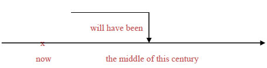

這個句子的時間副詞是介係詞片語 by the middle of this century。介係詞 by 表示的是一個截止時間，而這個截止時間在未來，所以動詞該採用未來完成式 will have been。後面的過去分詞 depleted 當形容詞補語看待，形容主詞 the last of our oil reserves。過去分詞字尾 -ed 表達出被動語態，所以 depleted 應解釋為「被用完」。這就是一般文法書所謂的未來完成被動態。

<u>In two more minutes</u>, she <u>will have been</u> talking on the phone <u>for three hours</u>!
(再過兩分鐘，她講電話就會一直講了3小時之久。)

圖示：

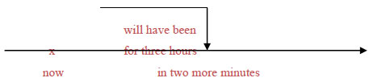

句中的介係詞片語 in two more minutes「再過兩分鐘」指向未來時間，另一個介係詞片語 for three hours「算算已經有3小時」表示一個截止的箭頭，所以動詞該採用未來完成式 will have been。後面的現在分詞 talking 視為形容詞、當主詞補語來形容主詞 she，字尾 -ing 表達出進行狀態，意思是「一直」講話。這就是一般文法書所謂的未來完成進行式。

<u>Leave</u> the test papers at the front desk <u>when you have finished the test</u>.
(考完式請把測驗卷放在最前面的桌上。)

圖示：

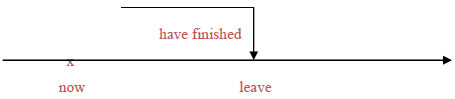

這個句子的主要子句是命令句語氣，所以動詞 leave 採用原形動詞。 When you have finished the test 是個時間副詞子句，連接詞 when 是外加的從屬連接詞、解釋為「當……時候」。所以，雖然說這句話時考試尚未考完，但是這個時間副詞子句中必須「當做已經到了考完的時候」，也就是必須把截止點當做就是現在，因此動詞要採用現在完成式 have finished 。一般文法書那條規則「表示時間或條件的副詞子句，用現在式代替未來式」就是這個情況。上例是表示時間的副詞子句，再舉一個表示條件的副詞子句為例：

You can leave early <u>if you have finished the test before the bell rings</u>.
(如果在鈴響之前已經寫完了測驗，就可以先離開。)

圖示：

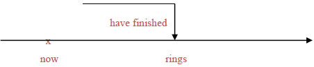

句中的 before the bell rings 是個時間副詞子句，以一個截止箭頭的形狀修飾動詞 have finished 的時間，before 是外加的連接詞。說這句話時雖然鈴尚未響，但是在時間副詞子句中必須當做時間已經到了，所以動詞要採用現在式的 rings。另外，if you have finished the test 是個表示條件的副詞子句，if 是外加的從屬連接詞、表示「如果」。在這種副詞子句中必須把假設的情況當做是真的，所以要用現在完成式 have finished 而不用未來完成式 will have finished。

## 時態一致性

一個句子當中如果有兩個以上的限定子句，就會有兩個以上的動詞。這些動詞在時態方面必須符合一致性：並不表示這些動詞的時態必須相同，而是這些動詞之間必須符合邏輯關係、並且表達出清楚的意思。例如下面這個句子就有問題：

Some buildings that were destroyed in the 921 earthquake were poorly constructed. （不佳）

這個句子可以分成主要子句 some buildings were poorly constructed 與關係子句 that were destroyed in the 921 earthquake。時間副詞是 in the 921 earthquake 這個介係詞片語，它括出一個過去時間的括弧，所以它修飾的關係子句的動詞應採用過去簡單式 were。但是，主要子句的時間應該不一樣：建築物被毀的時間是在 921 地震中、是過去時間，但是建築物建造的時間不可能是在 921地震中、應該是在之前才對。因此，主要子句的動詞應該採用過去完成式而非過去簡單式，如下：

Some buildings that <u>were</u> destroyed <u>in the 921 earthquake</u> <u>had been</u> poorly constructed.
(921大地震中被毀的房屋，其中有一些當初建造不良。)

圖示：

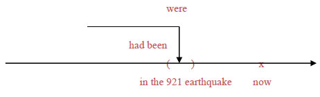

建築物被毀的時間是 in the 921 earthquake 這個過去時間的括弧內，因此關係子句的動詞應採過去簡單式 were，後面用過去分詞 destroyed 當形容詞補語，表達被動語態、表示「被毀」 。主要子句的動詞則應採用過去完成式 had been，表示這些建築物的建造時間是在 in the 921 earthquake 這個截止時間之前。後面用過去分詞 constructed 當形容詞補語，同樣表達被動語態、表示「被建造」。

請觀察下面這些例子當中的時態一致性：

<u>Never before</u> <u>had</u> rescue workers in Taiwan <u>handled</u> so many victims as they <u>did</u> <u>in the aftermath of 921</u>.
(臺灣的救難人員從來沒有像921過後那樣處理過那麼多的受害者。)

圖示：

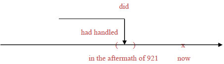

這是一個比較級的句子。從屬連接詞 as 引導的副詞子句 as they did in the aftermath of 921，裡面的時間副詞是 in the aftermath of 921 這個介係詞片語，它括出一個過去時間的括弧，所以動詞 did（代表handled ）採用的是過去簡單式。但是主要子句的時間副詞 never before 則是畫出一個箭頭形狀、截止時間是過去時間的 in the aftermath of 921，因此它的動詞應該採用過去完成式 had handled。

Under a provision of the law that <u>has never been</u> applied, the President <u>is</u> required to seek the approval of Congress before leading the country into war.
(依照該法律一項條文的規定（這項條文迄今從未被引用過），總統必須先取得國會的同意才能帶領國家參戰。)

圖示：

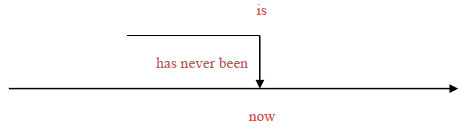

關係子句 that has never been applied 中，頻率副詞 never 畫出了一個以 now 為截止時間的箭頭，所以動詞應採用現在完成式 has been，後面的過去分詞 applied 表達被動語態、當形容詞補語看待，解釋為「被引用」。主要子句敘述的則是法律條文的規定，屬於「事實」的性質，動詞應採現在簡單式，所以用的是 is，後面用過去分詞 required 來表達被動語態，意思是「被要求」，當形容詞補語使用。